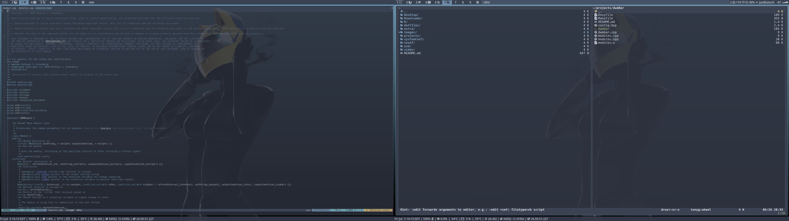

# Overview

`dwmbar` is a status bar for [dwm](https://dwm.suckless.org/) similar to [dwmblocks](https://github.com/torrinfail/dwmblocks). I wrote it in C++ just to troll the [suckless](https://suckless.org/sucks/) people. It has some built-in modules, but can also be extended with external scripts.

Each module can be set to update after a separate interval. Modules run as separate threads and alert the main thread to print to the root window when a change occurs. You can also run a module by issuing a real-time signal with `pkill`, e.g.

```sh
pkill --signal RTMIN+1 -x dwmbar
```

The signal ID is set per module during configuration (see below). Modules that are running on a schedule can still be activated by a signal.

`dwm` supports two status bars (bottom and top) if you have the `dwm-extrabar` patch.

# Install

To install clone this repository and use `make`:

```sh
cd dwmBar
make
sudo make install
```

This will put the `dwmbar` binary in `/usr/local/bin/` and assumes gcc is the compiler on the system. If you have llvm instead, use

```sh
make CXX=c++
```

# Dependencies

The project depends on a C++ compiler that understands C++11. It also requires `libX11` for printing to the root window. Some included modules also require [procfs](https://www.kernel.org/doc/Documentation/filesystems/proc.txt) to be mounted. This is available by default in most linux distributions, but may need to be explicitly mounted in BSD.

# Configure

`dwmbar` is configured by editing the `config.hpp` file. Comments within the file explain what to do and the available options. If you want to customize further, full interface documentation is [here](https://tonymugen.github.io/dwmBar), or you can run `doxygen` in the source code directory. The example configuration included here is the one I use on my main machine. The external shell scripts I use are included in the `scripts` directory.

Here is a screenshot from my system:

<center>

</center>
